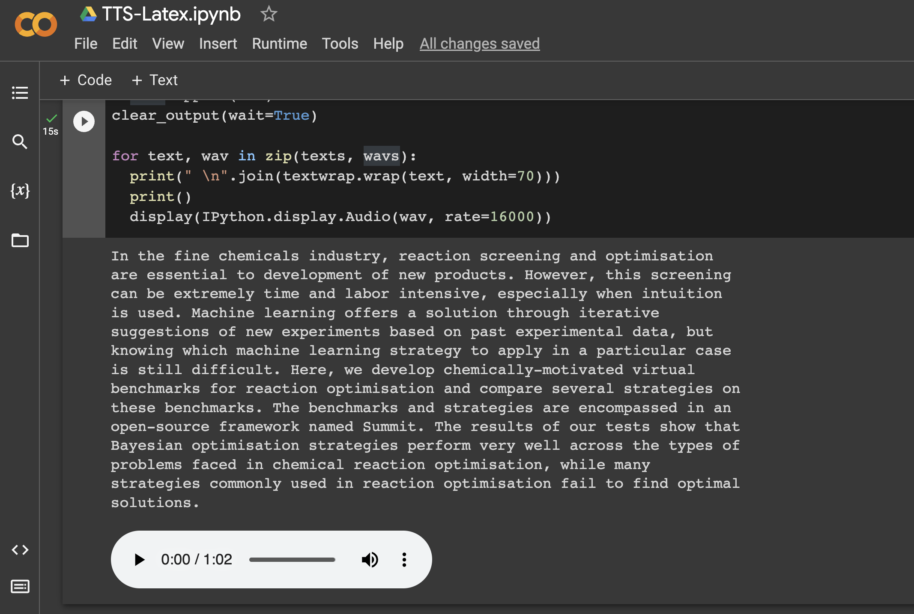

# Text to speech for Latex

Reading your papers aloud is a great way to catch errors or improve phrasing. However, most of us never read aloud because it's awkard and boring.  

Latex2Speech uses AI to read your Latex papers outloud, so you don't have to. Just click "Open in Colab" to get started without any local installation.

<!--  -->

## FAQ

FAQ:

- **Does this remove citation and reference commands?** Yes, automatically done!
- **How long does it take to generate speech?** The total TTS pipeline is ~4x realtime, so 1 minute of speech will take ~15 seconds. Note, that the first run will take longer, since the model needs to be downloaded.
- **What model does this use?** It uses the [Tacotron-DDC](https://coqui.ai/blog/tts/solving-attention-problems-of-tts-models-with-double-decoder-consistency) model from [Coqui-AI](https://github.com/coqui-ai/TTS).