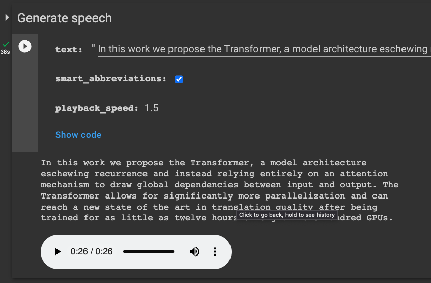

# Text to speech for Latex

This repo contains a Jupyter notebook that converts Latex into speech. It's useful for having your papers read back to you during editing/proofreading.

How to use:

1. Execute the cells under "Setup" to install all the necessary packages
2. Paste your latex code into the "texts" list and execute the cells.
3. Execte the remaining cells and you'll get audio players at the end for each paragraph.
